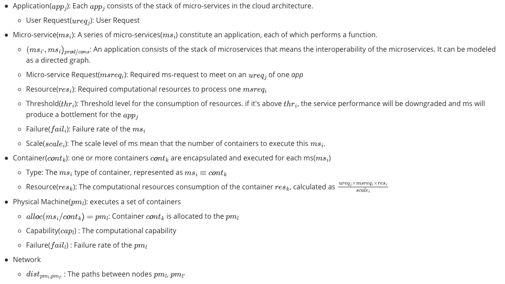
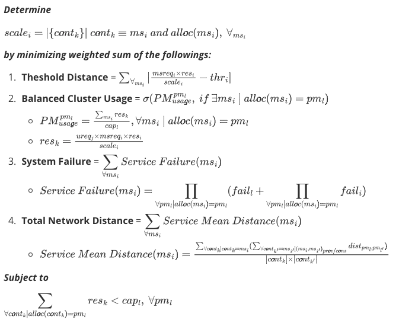
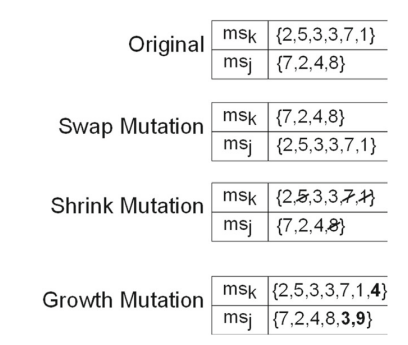

# GA-based CS Algorithm

This page consists of CS(Container Scheduling) algorithms based on the GA(Genetic Algorithm).

## 1. Justification of why you have chosen your topic.

My research topic is related data processing system, especially focusing on stream data. These days, the modern data processing system is based on the distributed system to process big, big, and big data. The most popular and common-used technology is the container which is a lightweight virtualization in providing cloud services. It provides portability, scalability, and flexible deployment. As the usage of these container technologies are rapidly growing, the scheduling is important that set properly an application as a subset of tasks in the distributed system, that consisting inter-connected nodes, to save cost-efficient operations of modern applications. So, it is one of core components in orchestration tool such as Docker SwarmKit, Google Kubernetes, Apache Mesos, and so on.

The container scheduling algorithms can be classified as the followings:

* Mathematical Modeling
* Heuristics
* Meta-Heuristics
* Machine Learning

Each class has different characteristics in terms of quality and performance. ***The container scheduling is a NP-complete problem, so it's the most widely used method to solve optimisation problems using `meta-heuristic` approaches***. The mathematical modeling techniques model the scheduling using Integer Linear Programming formulation, but it's limited for small size problems due to the complexity of computation. And, Machine Learning algorithms are successful because of big data to train the model. But, these algorithms has not been explored fully for container scheduling.

## 2. What is the topic?

***Container Scheduling*** which allocate tasks in distributed system as containers.

## 3. Design decision explaining why you select:

This design is based on the paper [3].

### 0. Chromosome Represetation

There are five elements in this problem *(you can refer the attributes for each element)*[3].  
*The string in brackets means an abbreviation of the full string.* 

*It's represented as an image due to unsupporting inline latex in Github. You can check the original text in `backup/README.md.bk` directory and get more clear image when you left-click this image.* 



We need to set some fixed applications and corresponding micro-services. 

**Example**

Abbreviations: *Microservice(ms)*, *Container(cont)*, *Physical Machine(pm)*

*pm1*
| cont1 | cont2 | cont3 | cont4 | cont5 | cont6|
|-|-|-|-|-|-|
| ms4 | ms1 | ms5 | ms4 | ms6 | ms4 |

*pm2*
| cont7 | cont8 | cont9 |
|-|-|-|
| ms3 | ms4 | ms5 |

*pm3*
| cont10 | cont11 | cont12 | cont13 |
|-|-|-|-|
| ms1 | ms2 | ms6 | ms3 |

The chromosome represetation of the above example is the following:

| microservice id | Physical Machine id |
| - | - |
| ms1 | {3, 1} |
| ms2 | {3} |
| ms3 | {2, 3} |
| ms4 | {1,2,1,1} |
| ms5 | {1} |
| ms6 | {1,2,3} |

### 1. Parameters such as the size of an initial population.

There are two type parameters: `basic parameters`, `application-specific parameters`. The `basic parameters` are genetic-algorithm parameters such as the size of population, crossover, mutation and the thresholds to finish the program. 

**TO BE CONTINUED FROM HERE.**

**Basic Parameters**

* *POPULATION_SIZE=200*
* *CROSSOVER_SIZE=POPULATION_SIZE/2*
* *MUTATION_SIZE=POPULATION_SIZE/10*

**Application-Specific Parameters**


**Parameters for element**

* *MAX_LENGTH_APPLICATIONS=1*
* *MAX_LENGTH_PHYSICAL_MACHINE=300*
* *MAX_LENGTH_MICROSERVICES=14*
* *MAX_LENGTH_CONTAINER=20*

**Parameters for stopping criteria**

* *STOP_MAX_INTERVAL_SOLUTIONS=10*
* *STOP_MAX_GENERATION=300*
* *STOP_THRESHOLD={NOT-DETERMINED}*


### 2. Stopping criteria.

We will stop this GA(Genetic Algorithm) when a fitness is larger than a given threshold. There are three options as following:

1. The maximum interval of solutions, which is no change in the given value as the parameter `STOP_MAX_INTERVAL_SOLUTIONS`(default: 10)
2. The fixed number of generations as the parameter `STOP_MAX_GENERATION`(default: 300)
3. The fitness value exceeds a given threshold as the parameter `STOP_THRESHOLD`(default: *{NOT YET}*)

*The criteria can be added for handling some errors and infinte loops.*

### 3. Fitness function.

*It's represented as an image due to unsupporting inline latex in Github. You can check the original text in `backup/README.md.bk` directory and get more clear image when you left-click this image.*


### 4. Selection operator.

`Fitness Proportional Selection`.

### 5. Crossover operator.

The crossover operator is quite simple method, `single-point crossover` operator. Parent can make two children at given single index.

##### 

### 6. Mutation operator.

There are three suggested methods, `SWAP`, `SHRINK`, and `GROWTH`  in [3].



### 7. Generational selection strategy.

`Elitism`

## 4. How to run your project.

### Installation
```Bash
git clone https://github.com/ctenhank/GA-based-CS-algorithm

# Recommend the usage of virtual environments
python3 -m venv venv
source venv/bin/activate

# (venv)
pip3 install -r requirements.txt

```

### Execution
```bash
python3 app.py
```

There are some options to execute this application, the container scheduling using meta-heuristice algorithm. One of the options is to select a fitness function to evaluate population.
```bash
# Select one of fitness function in ['scale', 'balance', 'failure', 'network']
# The fastest result is `balance` means the balanced cluster usage.
python3 app.py --fitness {OPTION_FITNESS}
```

## 5. How to adjust parameters.

There are basic parameters such as the following, other parameters can be added later.

* *POPULATION_SIZE*
* *MUTATION_SIZE*
* *CROSSOVER_SIZE*
* *THRESHOLD*
* *MAX_INTERVAL_SOLUTIONS*

As default, it will be assigned as global variables.

```Bash
TODO: How to configure these will be added the next week.
```

## Point-out

* No specific value in the parameter, stopping criteria.
* No specific fiteness values
    * Equations
    * Metrics
* More clear explainataion
* Can we merge ms and cont just as ms?


## Reference
[1] Casalicchio, Emiliano. "Container orchestration: A survey." Systems Modeling: Methodologies and Tools (2019): 221-235.  
[2] Ahmad, Imtiaz, et al. "Container scheduling techniques: A survey and assessment." Journal of King Saud University-Computer and Information Sciences (2021).  
[3] Guerrero, Carlos, Isaac Lera, and Carlos Juiz. "Genetic algorithm for multi-objective optimization of container allocation in cloud architecture." Journal of Grid Computing 16.1 (2018): 113-135.